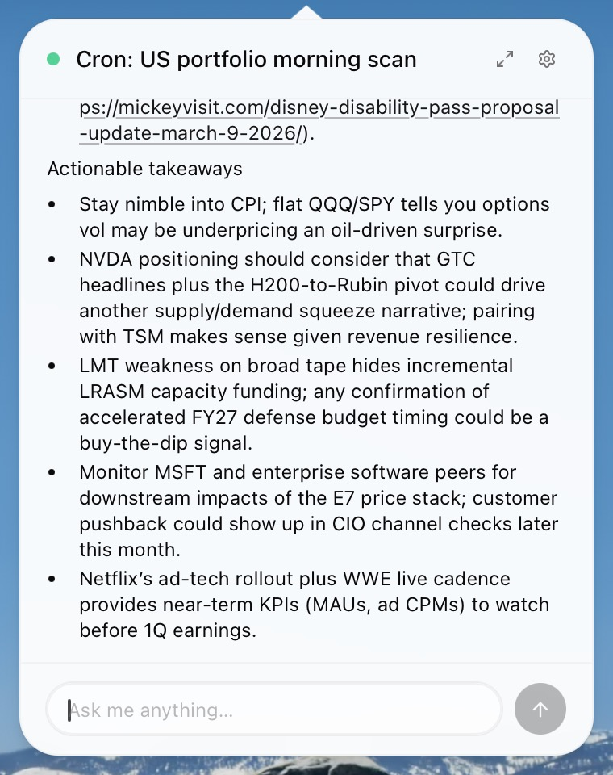
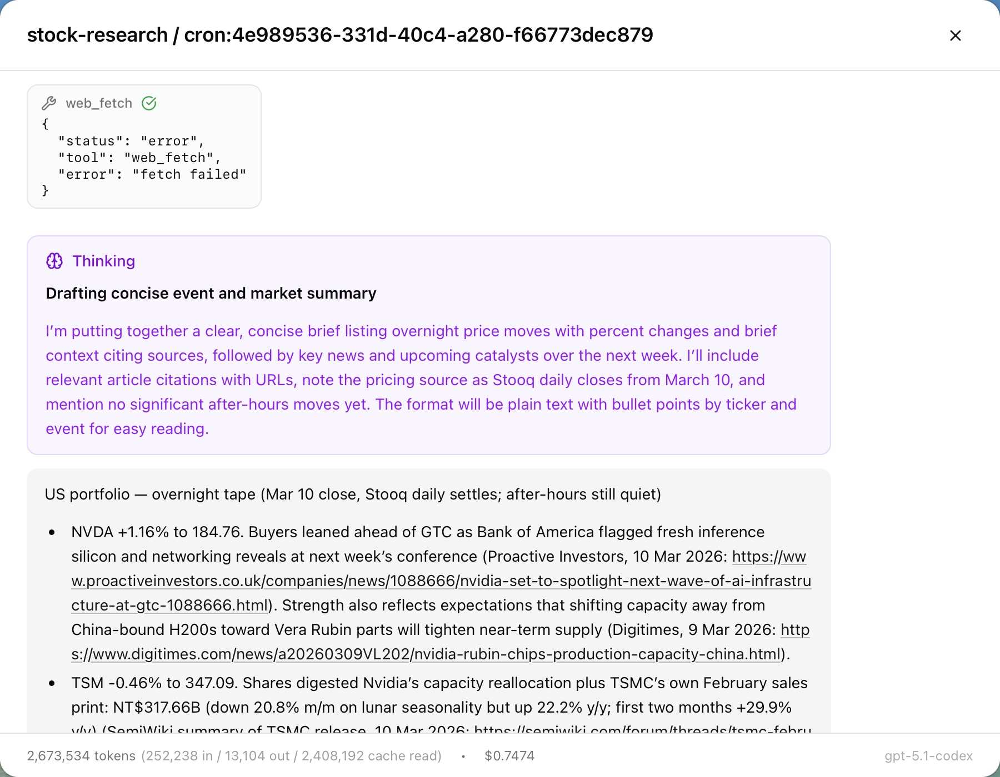
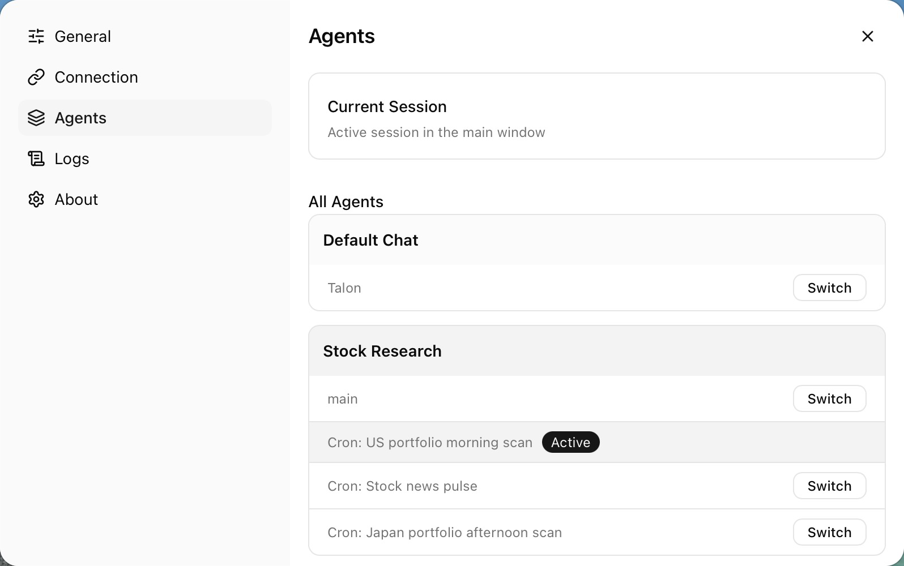
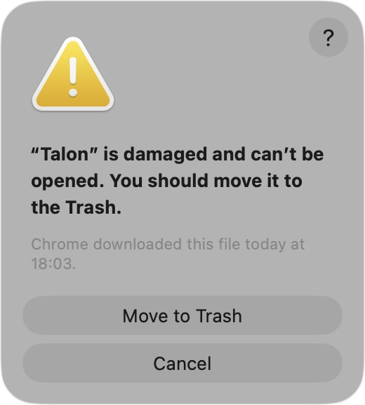
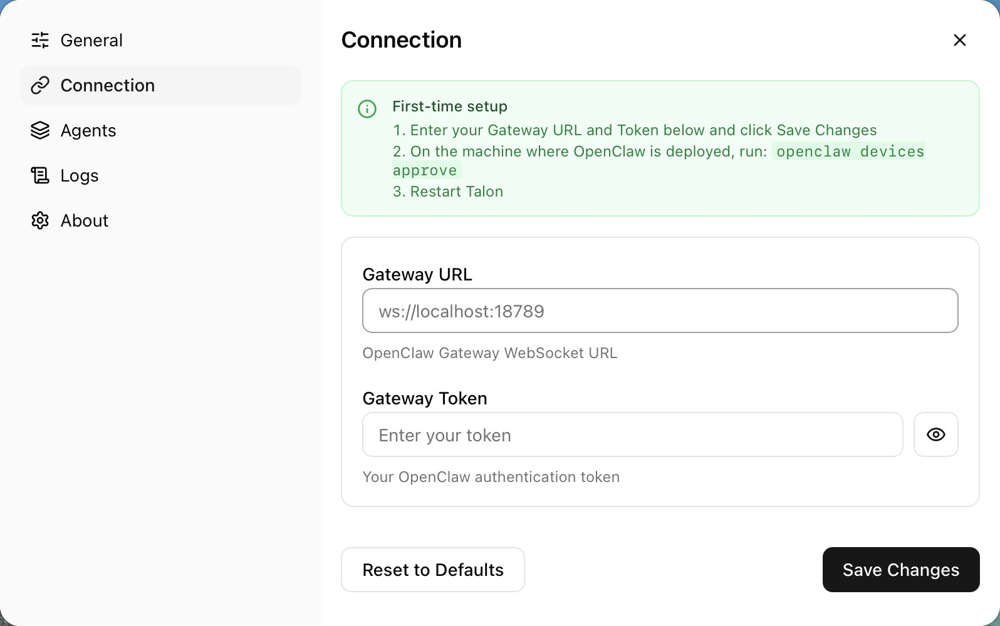

# Talon — Desktop AI Assistant

<p align="center">
  
</p>

A floating, always-on-top AI assistant for macOS, powered by the [OpenClaw](https://openclaw.ai/) gateway. Talon lives in your menu bar, stays visible across all Spaces, and lets you chat with multiple AI agents at once.

---

## Screenshots

### Main Panel

The compact floating window sits at the bottom-right corner of your screen. Click the avatar or the expand icon to open the full chat view.



### Full Chat View

Rich markdown, syntax highlighting, tool call traces, and token/cost statistics.



### Multiple Agents (Sessions)

Manage and switch between named agent sessions. Talon auto-switches to a session when a new message arrives.



---

## Features

- **Floating & always-on-top** — Transparent window that appears on all macOS Spaces
- **Animated avatar** — Lottie-based avatar with idle / thinking / speaking / error states
- **Full chat history** — Expandable chat window with markdown, KaTeX math, and syntax highlighting
- **Multiple agent sessions** — Create task-specific sessions (e.g. "Stock Research", "Gmail Monitor") and switch between them
- **Auto-switching** — Polls every 10 s; automatically jumps to the session that just replied
- **Desktop notifications** — Notified when a background session receives a new message
- **Tool call visibility** — See every tool call and result inline in the chat history
- **Privacy-first** — All data is stored locally via Tauri Store; requires a self-hosted OpenClaw gateway

---

## Prerequisites

Talon is a frontend client for the **OpenClaw** AI gateway. You need OpenClaw running locally (or on a remote machine you can reach) before Talon will connect.

### Install OpenClaw

```bash
curl -fsSL https://openclaw.ai/install.sh | bash
```

Or visit [openclaw.ai](https://openclaw.ai/) for alternative installation methods.

### Start the OpenClaw Gateway

```bash
openclaw gateway
```

This starts a WebSocket server at `ws://localhost:18789` by default.

---

## Installation

### Download (Recommended)

Download the latest `.dmg` from the [Releases](../../releases) page, open it, and drag Talon to your Applications folder.

### Build from Source

**Requirements**: Rust toolchain, Node.js ≥ 18, pnpm

```bash
# Install dependencies
pnpm install

# Development mode (Vite + Tauri with hot-reload)
pnpm tauri dev

# Production build → src-tauri/target/release/bundle/
pnpm tauri build
```

---

## macOS: "Talon is damaged and can't be opened"

Because Talon is not yet signed with an Apple Developer certificate, macOS Gatekeeper may show this error after downloading:



**Fix — Option 1: Remove quarantine attribute (recommended)**

Open Terminal and run:

```bash
sudo xattr -r -d com.apple.quarantine /Applications/Talon.app
```

Then launch Talon normally.

**Fix — Option 2: Allow via System Settings**

1. Try to open Talon — macOS will block it.
2. Go to **System Settings → Privacy & Security**.
3. Scroll down to the Security section and click **"Open Anyway"** next to the Talon entry.
4. Confirm in the dialog that appears.

> On macOS Sequoia (15+) the "Open Anyway" button may not appear. Use Option 1 instead.

---

## First-Time Setup

Open Talon's **Settings** (click the gear icon in the main panel or right-click the menu bar icon → Settings) and navigate to the **Connection** tab.



1. **Enter your Gateway URL** — default is `ws://localhost:18789`. If OpenClaw is on another machine, use its hostname/IP.
2. **Enter your Gateway Token** — your shared secret or device token from OpenClaw.
3. Click **Save Changes**.
4. On the machine where OpenClaw is deployed, approve this device:
   ```bash
   openclaw devices approve
   ```
5. **Restart Talon** — it will connect automatically on next launch.

---

## Usage

| Action | How |
|--------|-----|
| Show / hide window | Click the Talon icon in the menu bar |
| Send a message | Type in the input box and press Enter |
| Expand to full chat | Click the expand icon (↗) at the top-right of the bubble |
| Switch session | Settings → Agents → click **Switch** next to the session |
| Create a session | Settings → Agents → **New Agent** |
| Delete a session | Settings → Agents → select a session → **Delete** |

---

## Tech Stack

| Layer | Technology |
|-------|-----------|
| Frontend | React 19 + TypeScript + Vite |
| Desktop shell | Tauri 2.0 (Rust) |
| Styling | Tailwind CSS 4.x + shadcn/ui (Radix UI) |
| Animation | DotLottie |
| AI backend | OpenClaw WebSocket Gateway |
| Auth | Ed25519 keypair signing |
| Persistence | `@tauri-apps/plugin-store` |

---

## Development Commands

```bash
pnpm dev            # Vite dev server only (no Tauri)
pnpm tauri dev      # Full Tauri + Vite dev mode
pnpm build          # Build frontend
pnpm tauri build    # Build production .app / .dmg
pnpm format         # Prettier (import order + Tailwind class sort)
pnpm lint           # ESLint + TypeScript
```

---

## Recommended IDE Setup

[VS Code](https://code.visualstudio.com/) with:
- [Tauri](https://marketplace.visualstudio.com/items?itemName=tauri-apps.tauri-vscode)
- [rust-analyzer](https://marketplace.visualstudio.com/items?itemName=rust-lang.rust-analyzer)

---

## Contributing

Contributions are welcome! See [CONTRIBUTING.md](CONTRIBUTING.md) for guidelines.

## License

MIT

---

Made with ❤️ by [Yancey Leo](https://github.com/YanceyOfficial)
